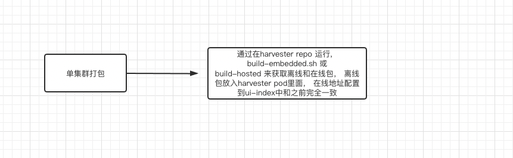
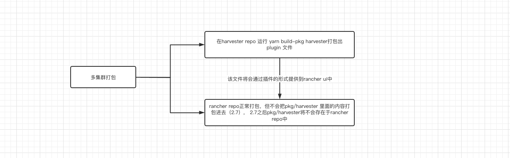

# Harvester Plugin

## Summary
The core code and components of rancher and harvester are very similar. Harvester hopes to easily reuse the common components of rancher ui and the steve architecture, without the need to push the code to the rancher dashboard repo. The purpose is to hope that the harvester can be released independently and not with rancher bindings.

### Related Issues

https://github.com/rancher/dashboard/issues/4109

## Motivation
It is hoped that the harvester can utilize the core code and common components of rancher, and can build the release version independently, and the multi-cluster harvester ui can also be easily integrated with the rancher.

### Goals

1. Harvester single cluster can be developed independently from rancher release
2. Hope rancher dashboard can be integrated with harvester by way of plugin configuration
3. In harvester multicluster you can configure individually for each imported harvester whether the resources accessed by the user are offline or online and the corresponding version

### Non-goals [optional]

## Proposal

### User Stories

#### 1. Harvester single cluster can be developed independently from rancher release
The ranchr dashboard will share the rancher core code through the npm package, so that other projects can generate the core steve and general component front-end architecture through the npm package.
The harvester will be used as a plug-in to develop business functions (the files in this directory will be packaged into one file and provided to multiple clusters). 

Note: The current plan is that harvester v1.1.0 will also be integrated into the rancher dashboard.

#### 2. Hope rancher dashboard can be integrated with harvester by way of plugin configuration
rancher loads the above provided module as a plugin into the rancher ui.
    **In order to ensure that users with different permissions can access the offline plug-in module, harvester will need to provide different users with the ability to access the resource through api (v1/public-assets). pending***

#### 3. Configure the access mode of each cluster separately
1. **In order to enable each imported harvester cluster to individually set whether to use offline resources or online harvester-plugin modules, the harvester backend needs to expose the ui-source information inside the harvester setting in some other way. (because cluster members do not have access to the settings).**
2. **In order to enable each imported harvester cluster to be configured with a separate version of the harvester plugin, and the current ui-index is provided for a single cluster to configure the full resource access address, so the harvester backend needs to add a configuration in the setting to save the address of the loading plugin, and allow any permission users to access.**

Tip: At present, the plugin configuration page provided by rancher cannot meet the needs of configuring different plugin versions for different harvesters.

### User Experience In Detail
1. Single-cluster users use ui-source and ui-index in the single-cluster setting page to determine how and where to get resources.
2. Multi-Cluster:
    1. User import harvester cluster in rancher， 
       1. The imported harvester does not support plugin, it loads the built-in harvester plugin resource packaged inside the rancher (the resource is offline)
       2. The imported harvester supports plugin, so when the user clicks on the harvester cluster, the front-end should be able to get the values of ui-source and plugin-index (newly added setting) in a way that the ui can get the corresponding plugin resources according to the given values.
    2. The admin user can configure the ui-source and plugin-index in the settings page of the imported harvester cluster

### API changes
1. The backend needs to add an interface without access control to provide the offline version of the plugin resources (v1/public-assets)
2. Add a plugin-index configuration item to the harvester setting page
3. Users with any privilege can access the values of ui-index and ui-source

## Design

### Implementation Overview

### Test plan

### Upgrade strategy

## Note [optional]

