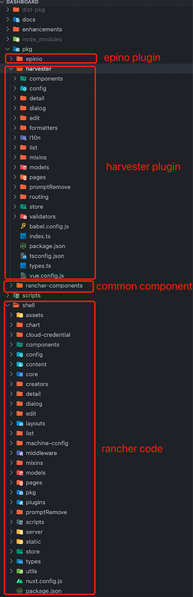
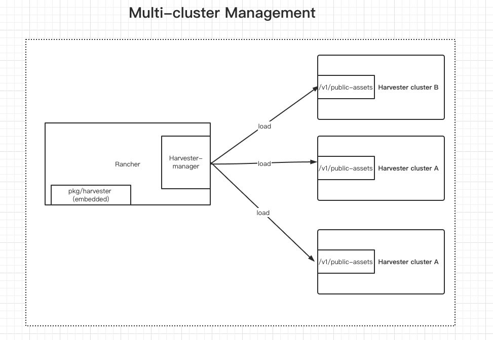

# Harvester Plugin

## Summary
The core code and components of rancher and harvester are very similar. Harvester hopes to easily reuse the common components of rancher ui and the steve architecture, without the need to push the code to the rancher dashboard repo. The purpose is to hope that the harvester can be released independently and not with rancher bindings.

### Related Issues

https://github.com/rancher/dashboard/issues/4109

## Motivation
It is hoped that the harvester can utilize the core code and common components of rancher, and can build the release version independently, and the multi-cluster harvester ui can also be easily integrated with the rancher.

### Goals

1. Harvester and Rancher as two different projects, hope to be developed and released independently.
2. Hope harvester can be managed by rancher.
3. In harvester multi-cluster, it is hoped that each imported harvester cluster can configure the version of the plugin and whether the access is an offline plugin or an online plugin

### Non-goals [optional]

## Proposal

### User Stories

#### 1. Harvester and Rancher as two different projects, hope to be developed and released independently.
The Ranchr dashboard will share the rancher core code through the npm package, so that other projects can generate the core steve and general component frontend architecture through the npm package.
So harvester can use the npm package here to achieve separation from the rancher project.  (the files in this directory will be packaged into one file and provided to multiple clusters). 

Note: The current plan is that harvester v1.1.0 will also be integrated into the rancher dashboard.

#### 2. Hope harvester can be managed by rancher.
rancher loads the above provided module as a plugin into the rancher ui.

Here's a known problem to solve:
  cluster member users do not have permission to access offline resources saved to the Harvester container.
  In order to ensure that users with different permissions can access the offline plugin module, harvester will need to provide different users with the ability to access the resource through api (`harvester/v1/public-assets`). (harvester backend)

#### 3. In harvester multi-cluster, it is hoped that each imported harvester cluster can configure the version of the plugin and whether the access is an offline plugin or an online plugin.
1. Because the harvester plugin is managed by each imported harvester cluster, we need to add `plugin-index` in the harveter setting to save the user configured plugin version. （harvester backend）
2. cluster member does not have access to `ui-souce` and `plugin-index`.  The values here will be exposed to the frontend by the harvester cluster through other api's (`harvester/v1/public-assets`) that do not have access control.  （harvester backend）

Tip: At present, the plugin configuration page provided by rancher cannot meet the needs of configuring different plugin versions for different harvesters.

### User Experience In Detail
1. Single-cluster users change ui-source and `ui-index` on the single-cluster settings page to determine the UI resource address.
2. multi-cluster:
    1. User import harvester cluster in rancher， 
        1. The imported harvester supports plugin, so when the user clicks on the harvester cluster, The frontend will decide to get the harvester plugin module from the address configured by `harvester/v1/public-assets` or `plugin-index` according to the value of `ui-souce`.
        2. The imported harvester does not support plugin, it loads the built-in harvester plugin resource packaged inside the rancher (the resource is offline).  
           The harvester plugin built into rancher is provided by the harvester repo. In order to be compatible with the harvester v1.0.x version, the harvester ui team will package a harvester plugin that does not include the new features of v1.1.0
       
    2. The admin user can configure the `ui-source` and `plugin-index` in the settings page of the imported harvester cluster

### API changes
1. The backend needs to add an interface without access control to provide the offline version of the plugin resources (`harvester/v1/public-assets`)
2. Add a `plugin-index` configuration item to the harvester setting page
3. Users with any privilege can access the values of `ui-index` and `ui-source`

## Design

### Implementation Overview

### Test plan

### Upgrade strategy

## Note [optional]

